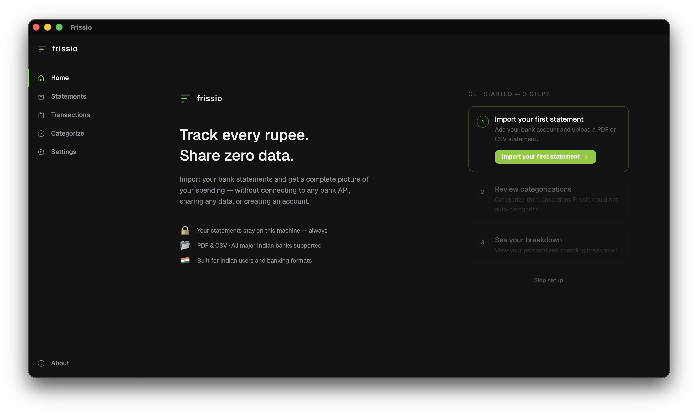
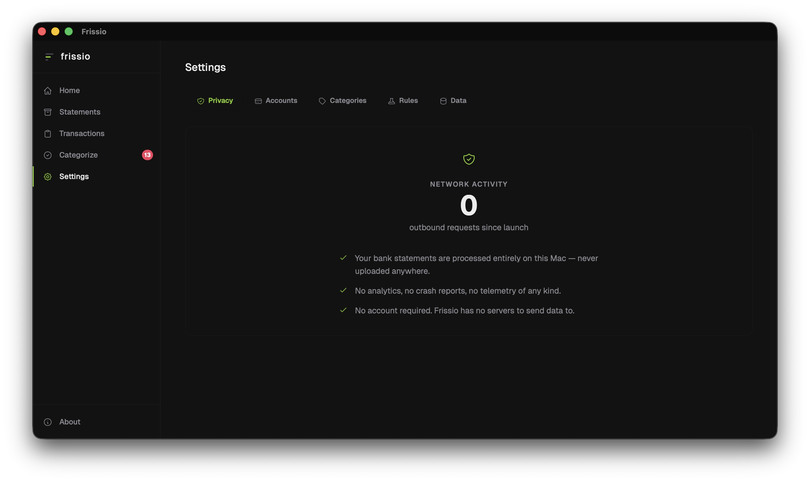
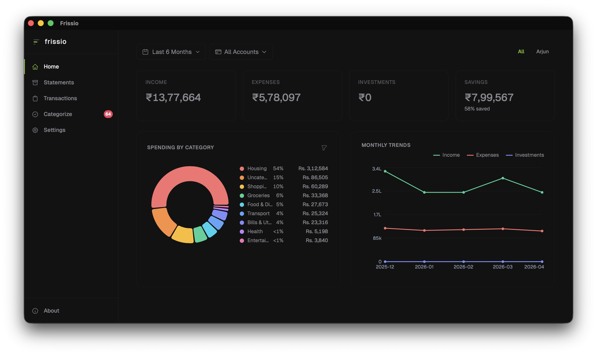
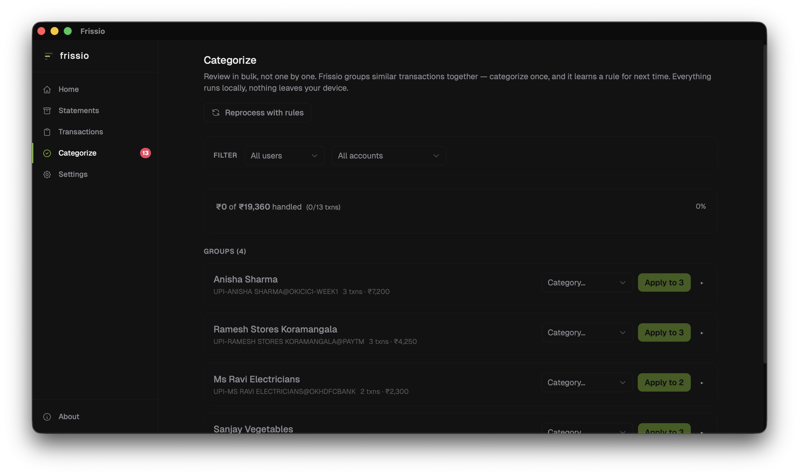

# Frissio

**Expense intelligence that stays on your device.**

The best expense tracker for privacy-aware Indian users. Statements never leave your Mac.

## Download

**[→ Get the latest release](https://github.com/rishul-agg/frissio-releases/releases/latest)**

macOS 12+ · Signed and notarized by Apple

## Why Frissio is different

Most expense trackers ask you to upload your statements, or worse, your bank credentials, to a server. So does pasting them into ChatGPT or any other AI tool.

Frissio runs entirely on your Mac. We've built it so macOS itself blocks the app from connecting to the internet. It's a hard guarantee enforced by Apple's system, not a promise from us.

*For the technically curious: the build ships without the `com.apple.security.network.client` entitlement. Verify with `nettop -p Frissio`.*

## What you get

- **Import any statement.** Native parsers for HDFC and ICICI (bank and credit card). Generic CSV for Axis, SBI, Kotak, Amex, or anything else.
- **Categorize once, never again.** Tag "ZOMATO ORDER #4823" once, and Frissio applies it to every Zomato transaction, past and future.
- **See the whole household.** Tag accounts by owner. Filter the dashboard by person to see who's spending what.
- **Own your data.** Everything lives in one SQLite file. One-click export to Time Machine, iCloud, an encrypted drive.
- **No account. No subscription. No telemetry.**

## About this repo

This repository hosts the Frissio macOS build and screenshots. The source is maintained privately. Issues and feedback: **support.frissio@gmail.com**.

---

[Privacy Policy](PRIVACY.md) · [License](LICENSE.md) · © 2026 Rishul Aggarwal
